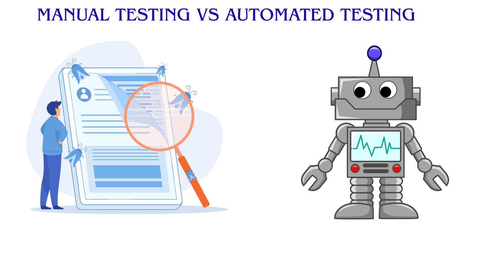

<h1 style="color:blue;"><strong>Difference Between Manual and Automated Testing</strong></h1>

<h2 style="color:#ff7f0e;"><strong>Technical Definition</strong></h2>

- **Manual Testing**: The process of executing test cases manually without automation tools. It relies on human effort, intuition, and observation.  
- **Automated Testing**: The process of executing test cases automatically using scripts and tools. It improves speed, accuracy, and repeatability.  

<h2 style="color:#ff7f0e;"><strong>Storytelling</strong></h2>
 
Imagine you’re proofreading a book.  
- In **manual proofreading**, you read page by page, carefully spotting spelling or grammar mistakes.  
- In **automated proofreading**, you use a tool like Grammarly—it checks quickly but may miss the creative flow or context.  

Similarly, manual testers focus on usability and unexpected behaviors, while automated testing covers repetitive checks efficiently.  

<h2 style="color:#ff7f0e;"><strong>Real-World Situation</strong></h2>

- **Manual**: Checking a new app’s UI for user-friendliness.  
- **Automated**: Running regression tests on an e-commerce app to ensure discounts still apply correctly after a code update.  
