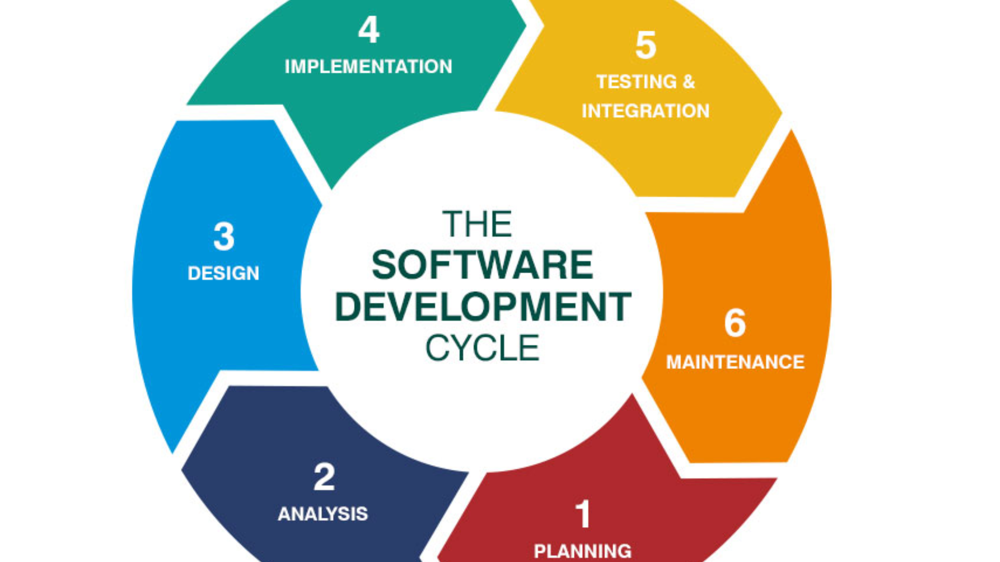

<h1 style="color:blue;"><strong>Software Development Life Cycle (SDLC) </strong></h1>

<h2 style="color:#ff7f0e;"><strong>Technical Definition</strong></h2>

SDLC is a structured process that defines the steps involved in developing high-quality software.  
It includes phases like:  
- Requirement Analysis  
- Design  
- Implementation  
- Testing  
- Deployment  
- Maintenance  

<h2 style="color:#ff7f0e;"><strong>Storytelling</strong></h2>
  
Think of SDLC as **building a house**:  
- You first gather requirements (what kind of house).  
- Create designs (blueprints).  
- Build the foundation and structure (coding).  
- Inspect the house (testing).  
- Hand over the keys (deployment).  
- Maintain it (repairs, updates).  

Without SDLC, building software would be like randomly throwing bricks together and hoping a house forms!  

<h2 style="color:#ff7f0e;"><Real-World Situation</strong></h2>

When creating a **banking app**:  
- Requirements → features like money transfer, balance check.  
- Design → UI/UX screens and database design.  
- Implementation → coding.  
- Testing → verifying money is transferred correctly.  
- Deployment → launching app to customers.  
- Maintenance → updating features, fixing bugs.  

