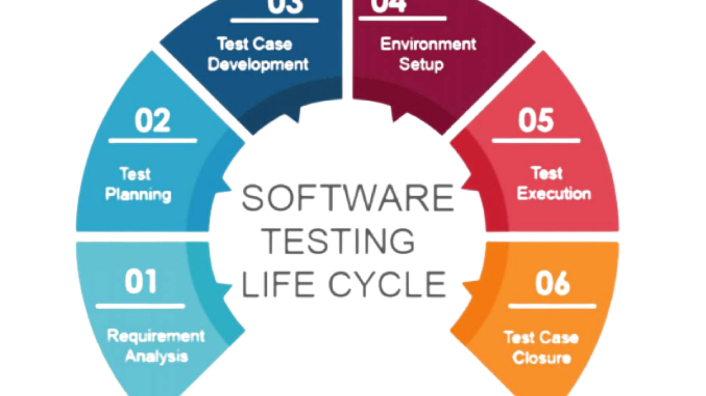

<h1 style="color:blue;"><strong>Software Testing Life Cycle</strong></h1>

<h2 style="color:#ff7f0e;"><strong>Technical Definition</strong></h2>

STLC defines the phases involved in the **testing process**, ensuring that quality is maintained.  
Phases include:  
- Requirement Analysis  
- Test Planning  
- Test Case Development  
- Environment Setup  
- Test Execution  
- Test Closure  

<h2 style="color:#ff7f0e;"><strong>Storytelling</strong></h2>

Think of STLC as **preparing for an exam**:  
- Requirement Analysis → checking syllabus.  
- Planning → creating a study schedule.  
- Test Case Development → writing down possible questions.  
- Environment Setup → arranging books, internet, study space.  
- Execution → giving the exam.  
- Closure → reviewing performance and results.  

Just like exam prep ensures success, STLC ensures software is tested thoroughly.  

<h2 style="color:#ff7f0e;"><strong>Real-World Situation</strong></h2>

Testing an **online food delivery app**:  
- Analyze requirements → login, search food, place order.  
- Plan → what to test, who will test, timelines.  
- Develop test cases → “What if user enters wrong address?”  
- Setup → test environment with mock payments.  
- Execute → run tests manually/automated.  
- Closure → prepare final test report.  