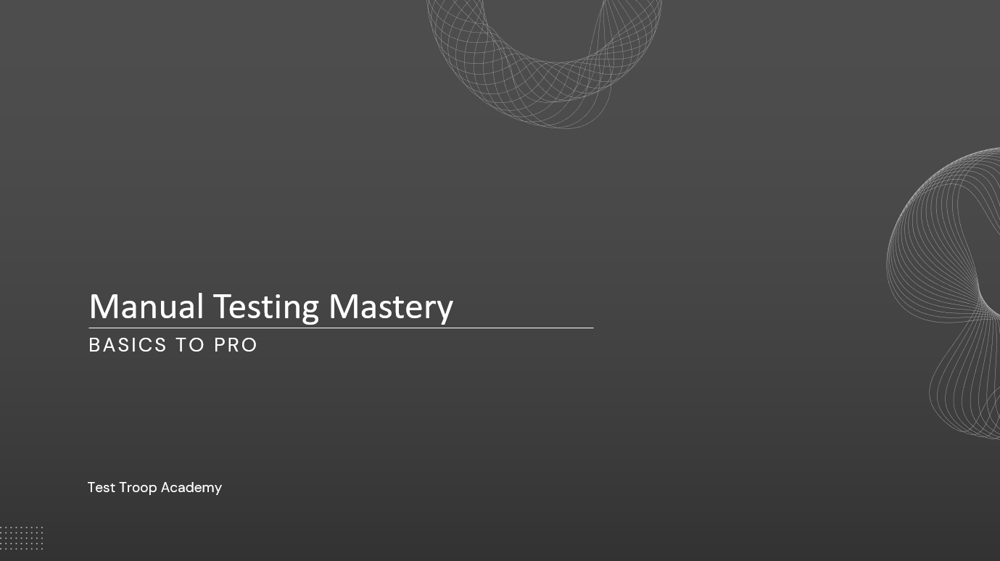

# Manual Testing: A Complete Guide

This course provides a comprehensive introduction to **manual software testing** and its applications in real-world projects. You’ll start with **testing fundamentals**—covering SDLC, STLC, types of testing, test design techniques, test planning, and defect management—before diving into **advanced topics** like exploratory testing, mobile/web application testing, performance basics, security basics, and best practices for testers.

Whether you're a beginner or an aspiring QA professional, this guide will equip you with the skills to test software effectively and become a proficient manual tester. 

## 📖 Course Topics  
For a detailed breakdown of the course topics, check out the [Course Overview](manual_testing/course_overview.md).
